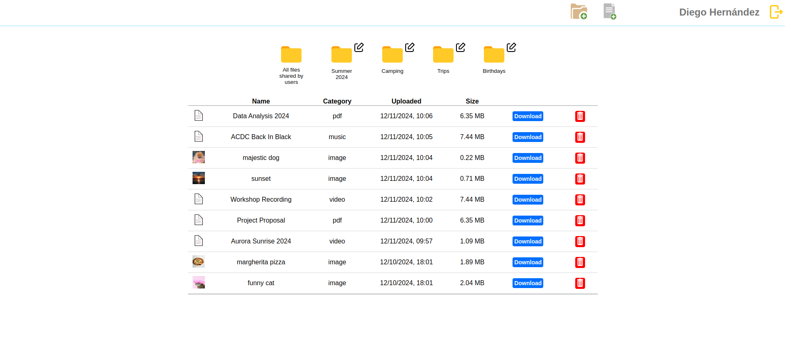

# file-uploader

Personal storage application created to practice the use of SQL and Prisma learned through <a href="https://www.theodinproject.com/lessons/nodejs-file-uploader" target="_blank">The Odin Project course</a>

<a href="https://fluffy-druid-2a5c81.netlify.app/authentication-page" target="_blank">Link to the app website</a>

<h2>Features:</h2>

<ul>
    <li>Registration and login</li>
    <li>Try the application via a demo account</li>
    <li>Create/Delete folders and files</li>
    <li>Edit folders</li>
    <li>Upload images, audio, videos and pdf</li>
    <li>Download files uploaded to the application</li>
    <li>Share uploaded files with other users</li>
    <li>Responsive design for mobile devices</li>
</ul>

<h2>Technology used:</h2>

<ul>
    <li>HTML</li>
    <li>CSS</li>
    <li>JavaScript</li>
    <li>React</li>
    <li>Node.js</li>
    <li>Express</li>
    <li>Prisma</li>
    <li>Neon</li>
    <li>Cloudinary</li>
    <li>Passport.js</li>
</ul>

<h2>Cloud hosting platforms</h2>

<ul>
    <li>Frontend <a href="https://www.netlify.com/" target="_blank">Netlify</a></li>
    <li>Backend <a href="https://fly.io/" target="_blank">Fly.io</a></li>
</ul>

<h2>Credit:</h2>

<h3>SVG</H3>
<ul>
    <li><a href="https://www.svgrepo.com/svg/295320/checkmark" target="_blank">Checkmark</a></li>
    <li><a href="https://www.svgrepo.com/svg/513869/x-square" target="_blank">Cancel</a></li>
    <li><a href="https://www.svgrepo.com/svg/474852/folder" target="_blank">Folder</a></li>
    <li><a href="https://www.svgrepo.com/svg/384405/document-file-file-type-page-paper-sheet" target="_blank">File</a></li>
    <li><a href="https://www.svgrepo.com/svg/384363/add-folder" target="_blank">Add Folder</a></li>
    <li><a href="https://www.svgrepo.com/svg/159652/add-file" target="_blank">Add File</a></li>
    <li><a href="https://www.svgrepo.com/svg/447635/file-signed" target="_blank">File Accepted</a></li>
    <li><a href="https://www.svgrepo.com/svg/447632/file-error" target="_blank">Missing File</a></li>
    <li><a href="https://www.svgrepo.com/svg/502760/logout" target="_blank">Logout</a></li>
    <li><a href="https://www.svgrepo.com/svg/56478/recycle-bin" target="_blank">Delete</a></li>
    <li><a href="https://www.svgrepo.com/svg/247765/left-arrow-back" target="_blank">Go Back Arrow</a></li>
</ul>

<h3>Images</H3>
<ul>
    <li><a href="https://www.pexels.com/it-it/foto/pomerania-marrone-chiaro-adulto-732456/" target="_blank">Majestic dog</a></li>
    <li><a href="https://www.pexels.com/it-it/foto/mare-blu-calmo-durante-l-ora-d-oro-1212600/" target="_blank">Sunset</a></li>
    <li><a href="https://www.pexels.com/it-it/foto/pizza-margherita-con-lievito-madre-con-basilico-fresco-tritato-16890470/" target="_blank">Margherita pizza</a></li>
    <li><a href="https://www.pexels.com/it-it/foto/ritratto-adorabile-baffi-occhi-di-gatto-4587959/" target="_blank">Funny cat</a></li>
</ul>

<h3>Music</H3>
<ul>
    <li><a href="https://www.youtube.com/watch?v=pAgnJDJN4VA" target="_blank">AC/DC - Back In Black</a></li>
</ul>
